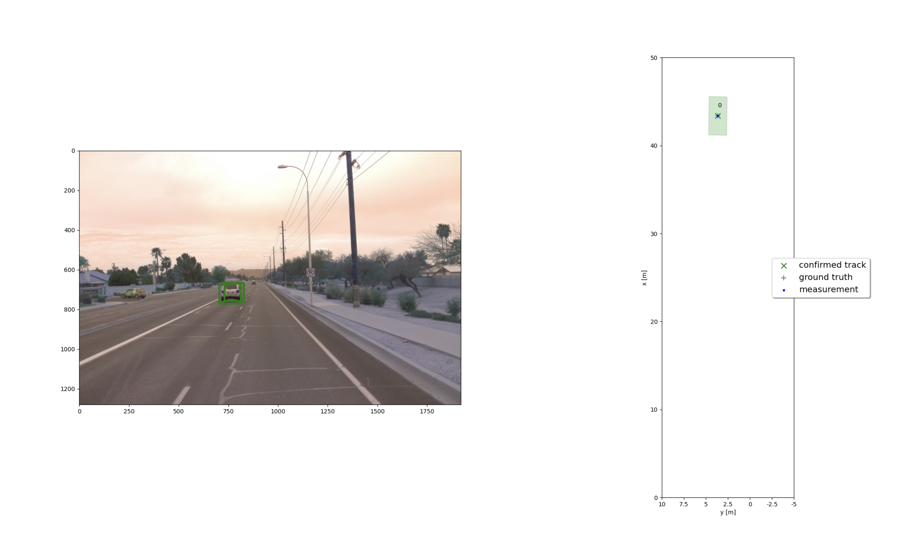
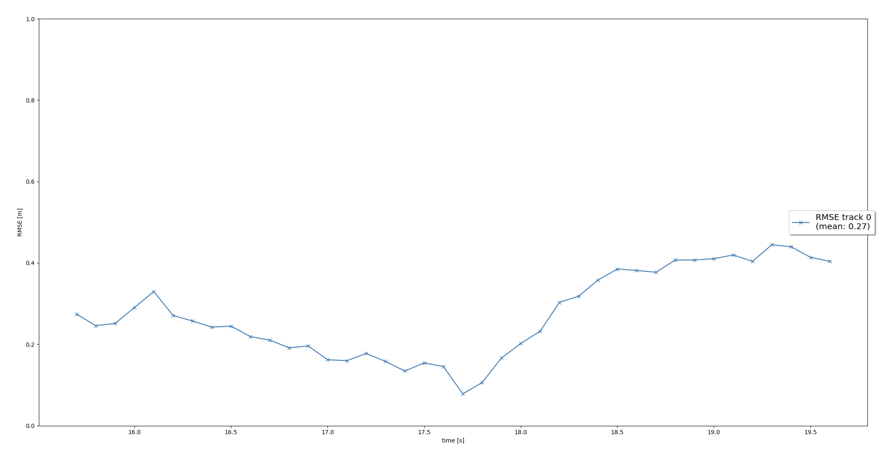
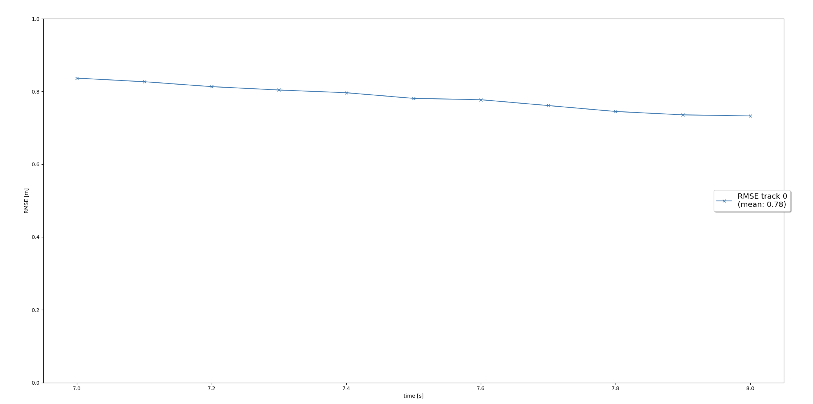
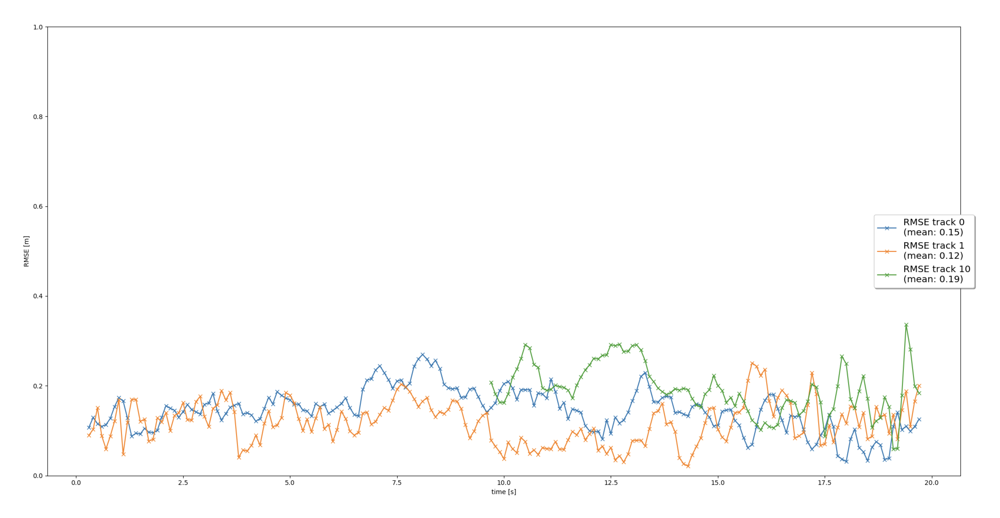
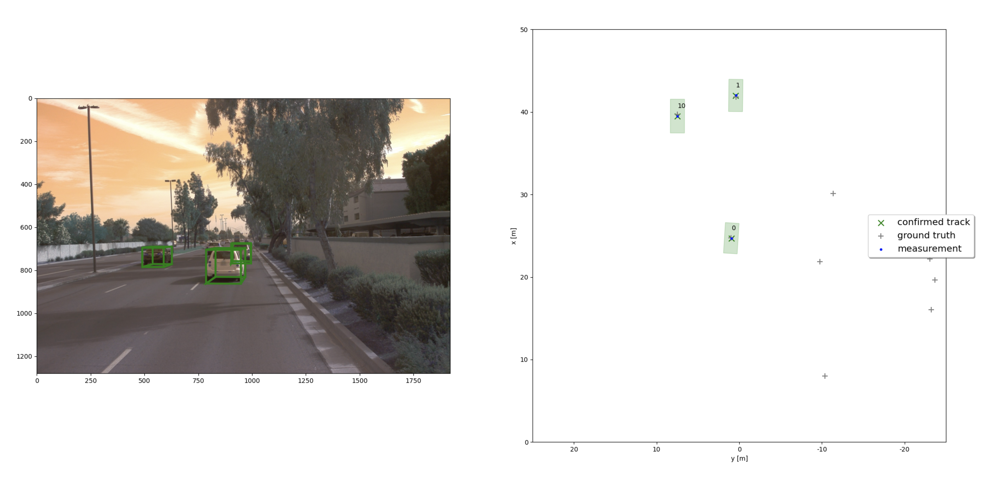
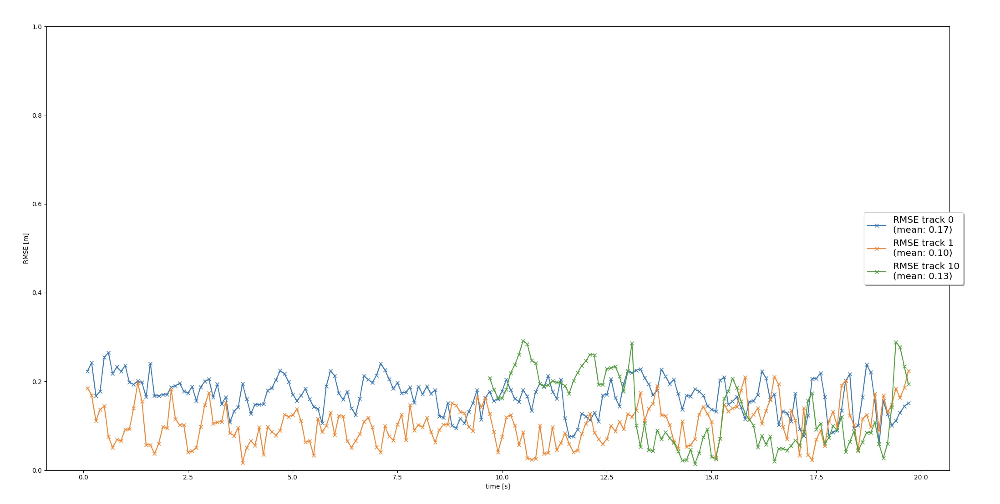

## Final Project: 3D Object Tracking over Time
The Final Project focuses on 3D object tracking (incl. height information) over time using camera and lidar sensor fusion via an extended Kalman filter (EKF). By evaluating the range, bearing and intensity information from the first order lidar response one can obtain range images (frontal projection) or a birds eye view (BEV) map of the lidar points. The bird's eye view map is fed to an object detector, which has been trained to detect object bounding boxes in such BEV projections yielding bounding box x-y-position, orientation angle, length and width of the respective 3D bounding box. The object height can be obtained from the z-coordinates of the top-most lidar points within an object bounding box in a BEV-map. The following documentation shows example plots generated by the implemented visualization functions in the code.

## Results

### Step 1: Single Target Object Tracking using an Extended Kalman Filter
In step 1, an Extended Kalman Filter (EKF) is implemented using a simple constant velocity model for target objects, or target vehicles, respectively. As its name says, the constant velocity model assumes rigit body motion with a constant velocity vector from one time step to another. This is a very simple assumption of true target object or target vehicle behavior, but it works for many cases well. In general, the implemented EKF allows variable time steps and corrects the prediction based on the inner process model of the target object's motion if a new measurement update occurs. In step 1, the EKF is initialized using fixed initial values, and measurement updates are generated only from lidar 3D object detections (or from 3D ground truth bounding boxes if configured). For lidar measurements, we have a linear measurement function h(x), and thus, a constant Jacobian H of h(x) at current state x. Later in step 4 of the Final Project, the EKF is extended by a non-linear measurement function h(x) for the camera measurements and a respective Jacobian H of h(x) at current state x, too.

A description of all required steps can be found in the code involving the following files:
- [objdet_detect.py](student/objdet_detect.py): copy from mid-term project
- [filter.py](student/filter.py): implement the predict() function for an EKF
- [misc/params.py](misc/params.py): Kalman filter parameters
- [student/trackmanagement.py](student/trackmanagement.py): prediction step for state x and state estimation error covariance matrix P
- [student/measurement.py](student/measurement.py): measurement update based on a linear measurement function h and the respective Jacobian H

 

 

Root Mean Square Error:
- The mean RMSE is 0.27, below 0.35 as the rubric requested
- The RMSE is displayed in following image:

### Step 2: Track Management
In step 2, a module was developed to handle the creation of new tracks, deletion of old tracks, and updating of states for existing tracks based on the acquired measurement data. A dictionary was utilized, with frames serving as keys and lists accumulating the presence or absence of camera and lidar measurements as corresponding values. This approach offers enhanced robustness by avoiding penalization of tracks with measurements from only one sensor or the absence of measurements from the other sensor. Furthermore, this approach expedites track confirmation when measurements from both sensors are available. 
This step allowed to handle the initialization of newly detected vehicles, updating current tracks, and removal of old ones. Each track includes a confidence score to represent the detection confidence level, as well as a state categorized as 'initialized', 'tentative', or 'confirmed'.

A description of all required steps can be found in the code involving the following file:
- [trackmanagement.py](student/trackmanagement.py): implement the associate(), get_closest_track_and_meas() function

Root Mean Square Error:
- The mean RMSE is 0.79
- The RMSE is displayed in following image:

### Step 3: Object Association of Tracks and Measurements
In step 3, an single nearest neighbor (SNN) track-measurement-association is implemented based on minimizing Mahalanobis distance of object detections (measurements) to tracks. The algorithm to associate tracks with measurements is very clever because it matches the nearest pair of track and measurement in the space formed by the Mahalanobis Distance (MHD), which is a space deformed by the statistical expectations of positions and velocities. And the algorithm continues to match the nearest pairs until there are no pairs to match.

A description of all required steps can be found in the code involving the following file:
- [association.py](student/association.py): implement the manage_tracks() handle_updated_track() function

Root Mean Square Error:
- Utilize a simple nearest neighbor approach with Mahalanobis distance to associate new measurements with current tracks for multi-target tracking.
- The RMSE is displayed in following image:

### Step 4: Completion of Camera-Lidar Sensor Fusion
In step 4, the final stage is implemented to accomplish the comprehensive sensor fusion system. The transformation of coordinates from two distinct sensors, each possessing different geometries, into vehicle coordinates is achieved through the utilization of homogeneous transformation matrices. Similarly, the conversion of vehicle coordinates into their respective sensor coordinates enables the computation of 'hx' and the Extended Kalman Filter's Jacobian. During this stage, confusion arose regarding the activation of camera measurements, despite adhering to the provided instructions meticulously. An extensive search was conducted to identify conditional statements, such as 'if sensor.name == 'lidar':' which were subsequently modified to 'if sensor.name in ['lidar', 'camera']:' with regrettable consequences. Eventually, it was realized that such modifications were unnecessary, as the omission of utilizing 'hx' when computing the Mahalanobis Distance (MHD) resulted in the exclusion of all camera measurements.

A description of all required steps can be found in the code involving the following file:
- [association.py](student/association.py): implement the in_fov(), get_hx(), generate_measurement() function of the Sensor class and initialize camera measurement objects in the Measurement class

Multiple tracked object as image below:

Root Mean Square Error:
- The Tracker works perfectly and follows the 2 important cars, Track 0 (blue) and track 1 (orange), from the begining to the end with mean RMSEs of 0.17 and 0.10. Track 10 (green) ishows a RMSW with mean 0.13. There are only 3 confirmed tracks with mean RMSEs below 0.25.
- The RMSE is displayed in following image:

Tracking video of multiple target objects over time in following video:

## Questions to Answer

### 1. Which part of the project was most difficult for you to complete, and why?

For me, the most challenging aspect of the project for me was gaining a comprehensive understanding of its overall structure. In addition to addressing all the TODOs, I found it necessary to thoroughly review the source code of every Python file in the entire project. I also stucked with the algorithms which are used in project. I have studied them in the lessons again and again to understand and implement them.
    
### 2. Do you see any benefits in camera-lidar fusion compared to lidar-only tracking (in theory and in your concrete results)?

In theory, cameras have more resolution and more frames per second than lidar. Hence, cameras are better at detecting objects in the environment, resolving ambiguities.

In my concrete results, I experienced a significant improvement in the accuracy when I finished implementing the Step 4, which fuses lidar measurements with camera measurements. Resolving the ambiguities of the video in Step 4 would be very difficult without camera measurements.

Camera measurements are ambiguous in the lines of ray tracing. Throughout these lines, any depth is valid and ambiguous. This ambiguity is resolved by using lidar measurements which have accurate depth information. Moreover, in the project there were big gaps of false negatives, lack of some lidar measurements. So, the fusion of cameras and lidars compensate their weaknesses.
    
### 3. Which challenges will a sensor fusion system face in real-life scenarios? Did you see any of these challenges in the project?

Cameras are less accurate at night and at estimating distances. Hence, sensor fusion systems must deal with these inaccuracies. Fortunately, the EKF has the mathematical foundations to deal with noisy measurements properly.

Yes, I saw in the project that camera measurements were less accurate than lidar measurements. Fortunately, theses cameras recorded videos in the day, not in the night, which would make this project harder.

### 4. Can you think of ways to improve your tracking results in the future?
In order to improve tracking results in the future, it is possible to enhance system performance, and ensure the reliability of tracking systems in various real-world scenarios.
Some ways could be:

1. Advanced Sensor Fusion: Continue to refine and develop advanced sensor fusion techniques that seamlessly integrate data from various sensors, such as cameras, LiDAR, radar, and other emerging sensor technologies.

2. Advanced Perception Algorithms: 
- Deep Learning Approaches: Explore and develop deep learning algorithms for object detection, recognition, and tracking. Deep neural networks can leverage large datasets to learn complex patterns and improve performance in diverse scenarios.
- Semantic Understanding: Integrate semantic understanding into tracking algorithms, allowing the system to recognize and anticipate the behavior of different objects based on their semantic characteristics.

3. Real-time Sensor Calibration:
- Continuous Calibration: Develop methods for continuous and real-time calibration of sensors to account for changes in the environment, sensor degradation, or other factors that can affect accuracy.

4. Continuous Learning and Adaptation: Implement online learning mechanisms that allow the system to adapt and improve its tracking capabilities over time based on real-world experience and changing conditions.

5. Sensor Hardware Advancements:
Next-gen Sensors: Keep pace with advancements in sensor technologies. Higher-resolution cameras, longer-range LiDAR, and improved radar systems can contribute to more accurate tracking.
